# ThermImPro (Thermal Image Processing)

Python GUI tool for viewing and analyzing radiometric thermal images. The tool processes raw thermal images, calculates estimated temperatures for each pixel, and applies a color palette to the image.

## Features

- Loading raw thermal images taken by FLIR cameras
- Calculating estimated temperatures in degrees Celsius and Fahrenheit
- Applying a color palette to the thermal image
- Displaying temperatures by hovering over the image
- Switching between color palettes
- Saving the processed thermal image

## Requirements

Install Python and run the following commands in a terminal or command prompt to install the required libraries.

- Python 3.x
- NumPy
- Matplotlib
- OpenCV

```
pip install numpy
```
```
pip install matplotlib
```
```
pip install opencv-python
```

ExifTool is required to access data and to extract raw thermal images from FLIR radiometric thermal images [[1]](#references). After installing, it is convenient to make a copy of the ExifTool executable (`exiftool(-k).exe`) in its directory and rename it to `exiftool.exe`. This way, `exiftool(-k).exe` can be used for accessing data from images, while `exiftool.exe` can be used for running ExifTool commands in a terminal or command prompt, without the need to constantly rename the executable.

In some cases, which will be explained later, you'll also need ImageMagick [[2]](#references).

**Note:** Don't forget to add the folders containing the ExifTool and ImageMagick executables to your PATH environment variable to avoid typing their full paths every time. Instructions are available online.

## Accessing raw thermal data from FLIR radiometric images

The process of converting raw values to temperatures won't be explained here, nor will the detailed concepts behind it. If you're interested, see the references below, which were used while researching and developing this software [[3-5]](#references).

So what exactly is a radiometric thermal image? It's an image captured by a radiometric thermal camera, and it contains useful data needed for the program. Here's an example of such an image.

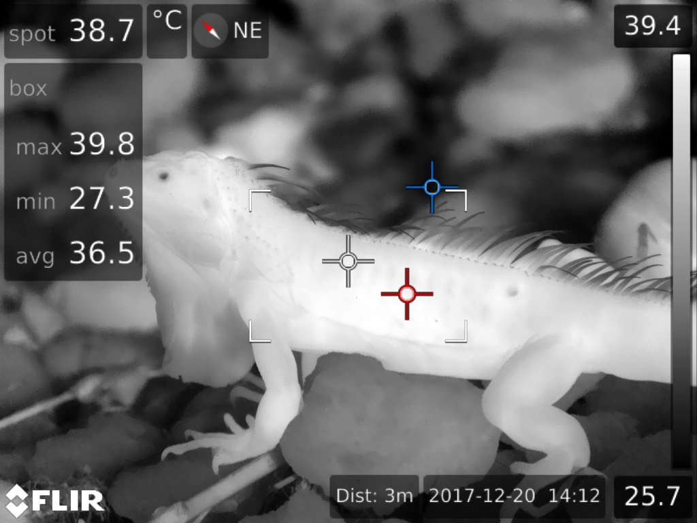

Typical radiometric thermal image [[6]](#references)

To access all required data, ExifTool is used. Simply, drag and drop a radiometric thermal image onto the `exiftool(-k).exe`. A command-line interface will appear showing various fields (see the image below). These are the image metadata.

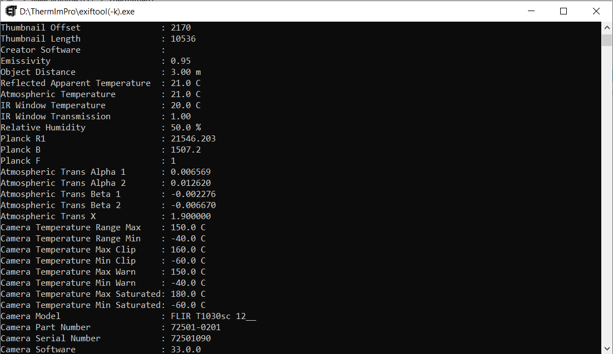

Only a few values from the metadata are needed, specifically the external and calibration parameters and some raw thermal image properties. Those used by ThermImPro are stored in the `metadata.json` file. This file can be edited with any plain-text or code editor (such as Notepad, VS Code, etc.). Values from ExifTool can be copied and pasted into the relevant fields, and the changes saved. **Note that the external parameters may vary between different images, and the calibration parameters are specific to each FLIR camera. If you want to load a new image, make sure to obtain the relevant metadata for that image.**

When using ExifTool, look for the values of the following parameters:

`Emissivity`  
`Object Distance`  
`Reflected Apparent Temperature`  
`Atmospheric Temperature`  
`Relative Humidity`  
`Atmospheric Trans Alpha 1`  
`Atmospheric Trans Alpha 2`  
`Atmospheric Trans Beta 1`  
`Atmospheric Trans Beta 2`  
`Atmospheric Trans X`  
`Planck R1`  
`Planck B`  
`Planck F`  
`Planck O`  
`Planck R2`  
`Raw Thermal Image Width`  
`Raw Thermal Image Height` 

Also make a note elsewhere of what `Raw Thermal Image Type` is.

To extract the raw thermal image, run the following command from a terminal or command prompt:

```
exiftool -rawthermalimage -b INPUT > OUTPUT
```

where `INPUT` is the path to the radiometric thermal image (e.g., `radiometric\green_iguana.jpg`), and `OUTPUT` is the path where the extracted image will be saved (e.g., `raw_16bit\green_iguana.png`). For the output file extension use the one you noted earlier (`Raw Thermal Image Type`).

Normally, the output image will look something like this:


However, if the image looks like this, the format is incorrect:


If this is the case, you need to change the byte order of the image. You can do this with ImageMagick by running one of the following commands in a terminal or command prompt:

```
magick INPUT pgm:- | magick -endian lsb pgm:- OUTPUT
```
```
magick INPUT gray:- | magick -depth 16 -endian msb -size SIZE gray:- OUTPUT
```
```
magick -define png:swap-bytes=on INPUT OUTPUT
```

where `INPUT` is the path to the broken extracted image, `SIZE` is the image dimensions (e.g., `1024x768`), and `OUTPUT` is the path where the fixed image will be saved.

Once the image format is fixed, it can be loaded into the program.

## Usage

To run ThermImPro, simply open and run the `main.py` source code file. This will open a dialog window where you can select the extracted raw thermal image to load. Once the image is loaded, the GUI will appear, as shown in the image below.

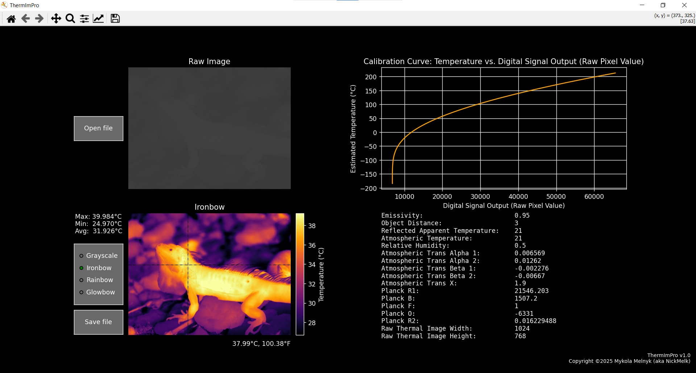

The interface is divided into four sections:
- Raw thermal image
- Processed thermal image
- Calibration curve (Temperature vs. Digital Signal Output)
- List of all metadata parameters

By hovering over either image, you can see the temperature at that point in degrees Celsius and Fahrenheit. The fields to the left of the processed image display the maximum, minimum, and average temperatures. You can choose from the grayscale, ironbow, rainbow, and glowbow color palettes.

Using the Save button, you can save the processed image. All images are saved in the JPG format in the `output` folder within the program directory. If the folder doesn't exist, create it manually.

Before opening another image with the Open button, ensure that the relevant metadata for that image has been obtained. Otherwise, the program may produce incorrect results or behave unexpectedly.

Below, you can see the image displayed in different color palettes.

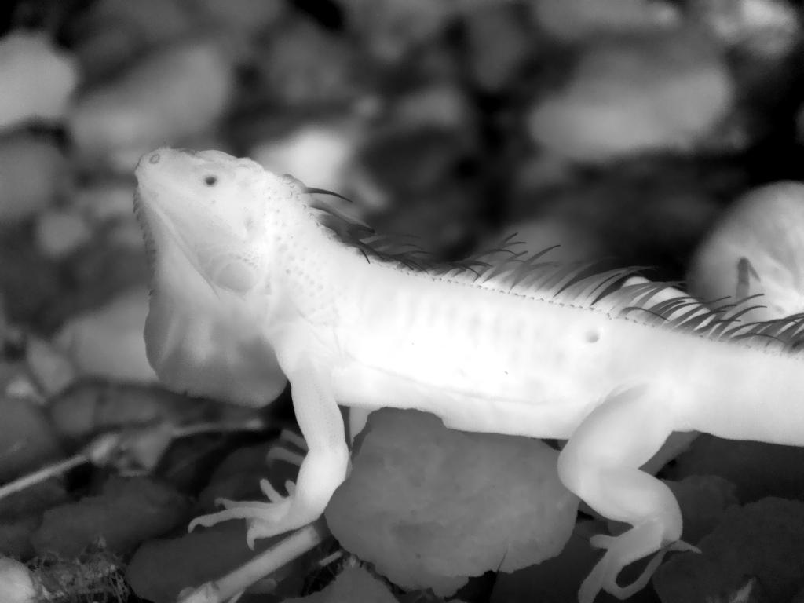
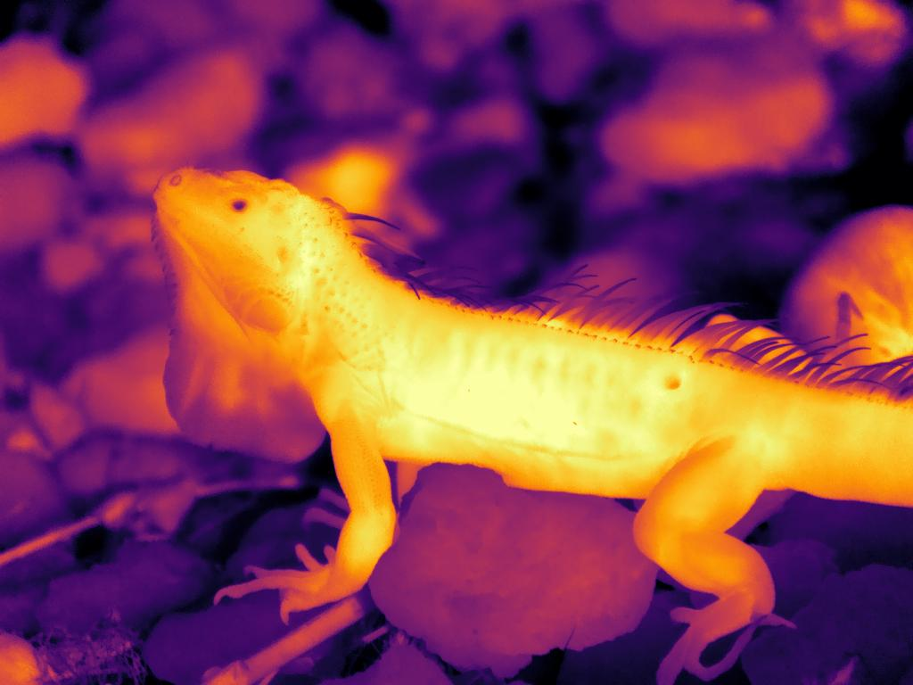
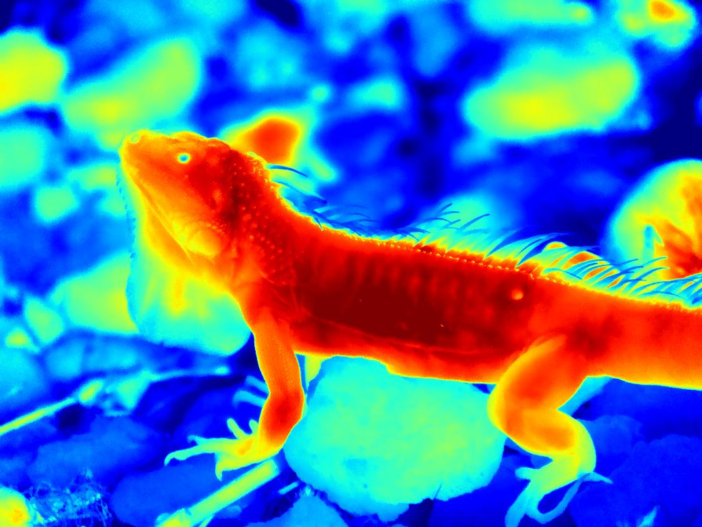
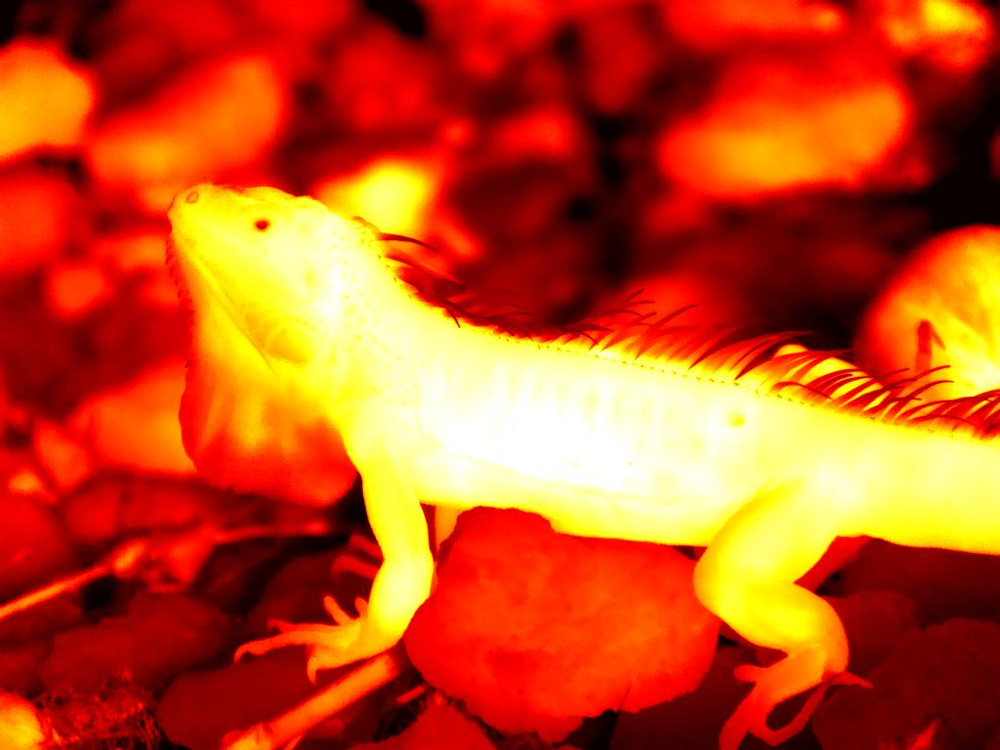

The functionalities of the Python Matplotlib library provide even more options for analysis, such as zooming in and out to examine specific points more closely, more color palettes and other useful features.

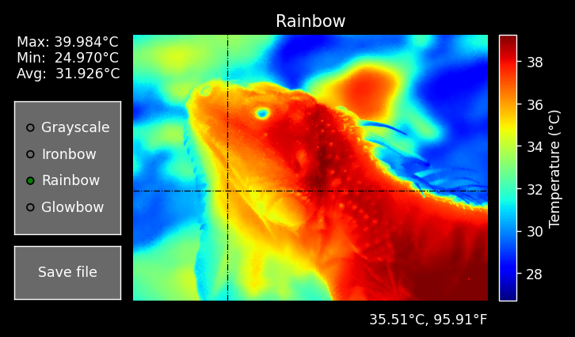

## More Examples

|             | Radiometric thermal image from [[7]](#references)                 | Radiometric thermal image from [[8]](#references)              |
| ----------- | ----------------------------------------------------------------- | -------------------------------------------------------------- |
| Radiometric | 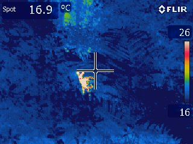 | 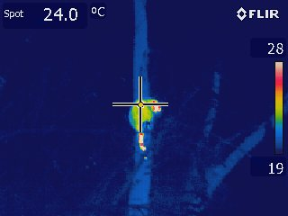 |
| Grayscale   | 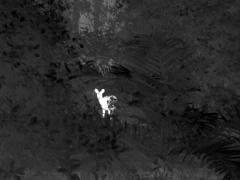                                    | 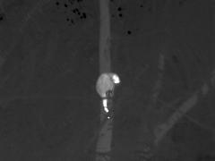                                 |
| Ironbow     | 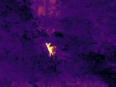                                    | 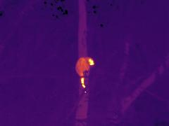                                 |
| Rainbow     | 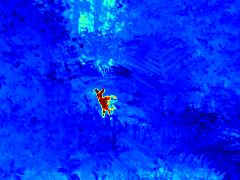                                    | 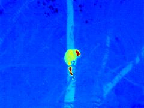                                 |
| Glowbow     | 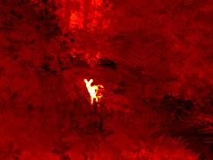                                    | 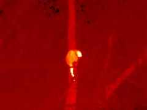                                 |

## References

1. ExifTool - [Download from here](https://exiftool.org/install.html).
2. ImageMagick - [Download from here](https://imagemagick.org/script/download.php).
3. tomas123. Re: Flir Ex: Realtime raw radiometric data streaming via UVC [Forum post]. EEVblog Electronics Community Forum. https://www.eevblog.com/forum/thermal-imaging/flir-ex-realtime-raw-radiometric-data-streaming-via-uvc/msg744673.
4. Josh Veitch-Michaelis. Radiometry [Documentation]. Flirpy. https://flirpy.readthedocs.io/en/latest/getting_started/cameras.html.
5. Glenn Tattersall. gtatters/Thermimage: Thermimage v4.1.3 [Documentation/Repository]. Zenodo. https://doi.org/10.5281/zenodo.5525416.
6. Glenn Tattersall. Iguana iguana [Image]. TrEnCh-IR. https://trench-ir.azurewebsites.net/page?name=6204867555843852-Iguana_IR_2017-12-20_1478.jpg.
7. Rabello Monteiro. Mazama gouazoubira [Image]. TrEnCh-IR. https://trench-ir.azurewebsites.net/page?name=39637009225835085-IR_0918.jpg
8. Rabello Monteiro. Porcupine [Image]. TrEnCh-IR. Original link no longer available.
9. Brian Helmuth. Phascolarctos cinereus [Image]. TrEnCh-IR. https://trench-ir.azurewebsites.net/page?name=10561635672528502-Koala1.jpg.
